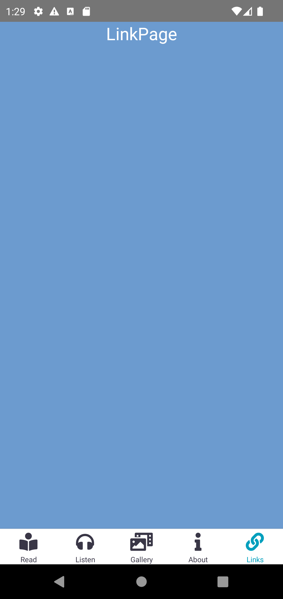

# In this repository, a small application was developed using React Navigation library with the combination of Stack Navigator and BottomTabs Navigator.
### Used technologies
<ul style="list-style-type:disc">
   <li><a href="https://reactnative.dev/">React Native</a></li>
   <li><a href="https://reactnavigation.org/">React Navigation</a></li>
   <li><a href="https://reactnavigation.org/docs/stack-navigator">Stack Navigator</a></li>
   <li><a href="https://reactnavigation.org/docs/bottom-tab-navigator">BottomTab Navigator</a></li>
</ul>

### Running a project for android
<ul>
<li>npm install</li>
<li>npx react-native run-android</li>
</ul>

### 👋

https://medium.com/@bstkpnr/developing-a-simple-app-with-react-native-using-react-navigation-ef8247bfb27d
